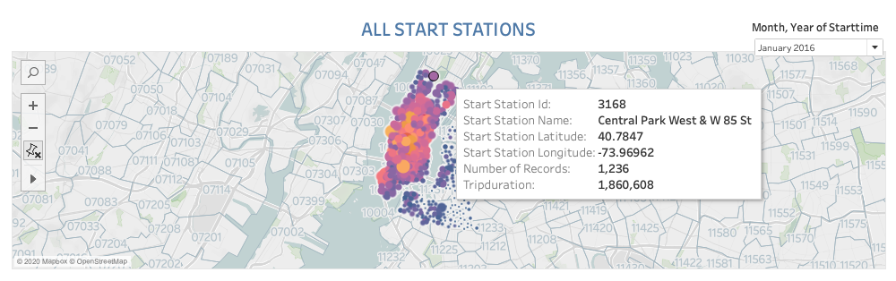
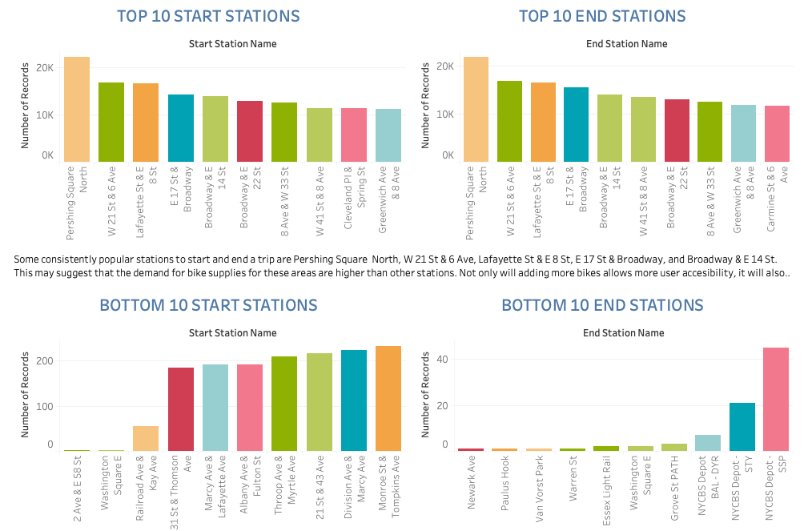
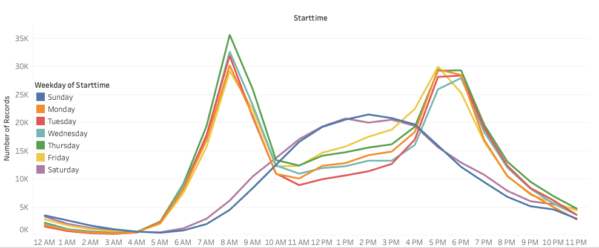

# Citi Bike Analytics

This Dashboard visualizes data from the New York Citi Bike Program. It analyzed daily reports of bike trips during winter months from 2015 to 2016. The purpose of this project is to provide helpful suggestions for city officials looking to publicize and improve the city program.

The Citi Bike Dashboard is hosted on a [tableau public account](https://public.tableau.com/profile/thu.nguyen1946#!/vizhome/tableau-challenge_15811258880980/CITIBIKEPROGRAMANALYSIS).

### Data Exploration

In this exploration, the months December, January, and February are considered winter months. Bike logs during the winter of 2015-2016 are selected from the City Bike Trip History and aggregated into a new dataset using an inner join. 

### Dynamic Map
The first visualization on the dashboard is a dynamic map that shows how each station's popularity changes over time. The map is overlaid with zip code data and contains a dropdown option at the top that allows users to filter by month and year. This is accomplished by using features in Tableau public.

### Bar Graphs
The top two bar graphs represent the top 10 stations to start and end at, while the bottom graphs represent the bottom 10 stations. Stations popularity is ranked by the number of bike records at that station (i.e the most popular station would have the highest record of bike logs). 

### Line Chart
Similarly, the most popular start time for a trip is determined by the number of records for each station. Hovering over a data point on the line chart would show the start time of the trip, the day during week of the trip and the number of records for that specific station. 

### Discoveries
According to the line chart, the most popular times to ride a bike are during the mornings and evenings. The peak hours are  8 - 9 AM and 5 - 6 PM because people are commuting to work or class and then returning home in the evening around those time frames. 

Some consistently popular stations to start and end a trip are Pershing Square  North, W 21 St & 6 Ave, Lafayette St & E 8 St, E 17 St & Broadway, and Broadway & E 14 St. The bar graphs may suggest that the demand for bike supplies for these areas are higher than other stations. Not only will adding more bikes allows more user accesibility, it will also reduce the repair fees on heavily bikes.

